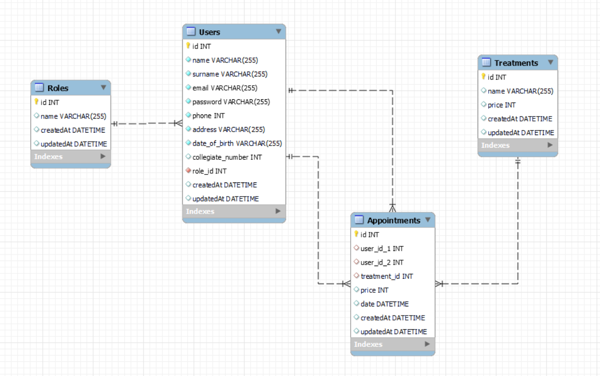

# Backend Clinica Dental

<details>
  <summary>Contenido 📝</summary>
  <ol>
    <li><a href="#objetivo">Objetivo</a></li>
    <li><a href="#sobre-el-proyecto">Sobre el proyecto</a></li>
    <li><a href="#stack">Stack</a></li>
    <li><a href="#diagrama-bd">Diagrama</a></li>
    <li><a href="#instalación-en-local">Instalación</a></li>
    <li><a href="#endpoints">Endpoints</a></li>
    <li><a href="#licencia">Licencia</a></li>
    <li><a href="#webgrafia">Webgrafia</a></li>
    <li><a href="#agradecimientos">Agradecimientos</a></li>
    <li><a href="#contacto">Contacto</a></li>
  </ol>
</details>

## Objetivo
En el siguiente proyecto se ha creado el backend para el sistema de gestión de citas de una clínica dental. Se ha realizado en un entorno educativo para GeeksHubs Academy utilizando Express y Sequelize.

## Sobre el proyecto
Las funciones que se pueden realizar en la API serán tanto el registro de usuarios como su login. A la hora de hacer el registro se asignará el rol de paciente de forma automática, aunque si se trata de un dentista o administrador podremos cambiar su rol en la base de datos para que puedan acceder a diferentes endpoints.

Una vez hecho el login como paciente podremos ver nuestro perfil de usuario y modificarlo. Podremos consultar los diferentes tratamientos que se ofrecen así como los diferentes dentistas de la clínica, y con esa información podremos crear una cita. También seremos capaces de modificarla o borrarla. Una vez creada la cita la podremos consultar de forma individual o, si tenemos más de una, de forma conjunta.

Los dentistas la clínica además pueden ver la lista de todos los pacientes y todas las citas a su nombre.

Los administradores también tendrán acceso a borrar un perfil de usuario, ver el listado de todas la citas creadas, y crear, modificar y borrar tanto los tratamientos como los roles.   


## Stack
Tecnologías utilizadas:
<div align="center">
        <a href="https://www.sequelize.org/">
        
    </a>
        <a href="https://www.mysql.com/">
        
    </a>
        <a href="https://expressjs.com/">
        
    </a>
    <a href="https://nextjs.org/">
        
    </a>
    <a href="https://developer.mozilla.org/es/docs/Web/JavaScript">
        
    </a>
    <a href="https://jwt.io/">
        
    </a>
    <a href="https://www.postman.com/">
        
    </a>
    <a href="https://www.docker.com/">
        
    </a>
 </div>


## Diagrama BD


## Instalación en local
1. Clonamos el repositorio `$git clone 'url-repository'`
2. Instalamos las dependencias ` $ npm install `
3. Conectamos nuestro repositorio con la base de datos ` $ npx sequelize db:create `
4. Ejecutamos las migraciones ` $ npx sequelize db:migrate `
5. Ejecutamos los seeders ` $ npx sequelize db:seed:all ` 
6. Conectamos el servidor` $ npm run dev ` 


## Endpoints
<details>
<summary>Endpoints</summary>

- AUTH
    - REGISTER

            POST http://localhost:3000/auth/register
        body:
        ``` js
            {
                "name": "Andrea",
                "surname": "Suarez",
                "email": "andrea@andrea.com",
                "password": "Andrea123!",
                "phone": 666666666,
                "address": "C/ Denia 1",
                "date_of_birth": "1991-01-01"
            }
        ```

    - LOGIN

            POST http://localhost:3000/auth/login  
        body:
        ``` js
            {
                "email": "andrea@andrea.com",
                "password": "Andrea123!"
            }
        ```

- PROFILE
    - GET PROFILE  

            GET http://localhost:3000/users/profile

    - UPDATE PROFILE  

            PUT http://localhost:3000/users/profile
        body: (Solo se puede modificar el email, teléfono y dirección)
        ``` js
            {
                "email": "andrea@andrea.com",
                "phone": "612345678",
                "address": "C/ Denia 4"
            }
        ```

    - DELETE PROFILE  (Solo como admin)

            DELETE http://localhost:3000/users/profile/:id

    - GET PROFILE DE TODOS LOS PACIENTES (Solo como dentista)  

            GET http://localhost:3000/users/patients

    - GET PROFILE DE TODOS LOS DENTISTAS

            GET http://localhost:3000/users/dentists

- APPOINTMENTS
    - CREATE APPOINTMENT

            POST http://localhost:3000/appointments
        body: (Necesitaremos el id del dentista, el id del tratamiento y la fecha)
        ``` js
            {
                "user_id_2": 4,
                "treatment_id": 8,
                "date": "2023-06-10 17:00:00",
            }
        ```
    - UPDATE APPOINTMENT  

            PUT http://localhost:3000/appointments/:id
        body:
        ``` js
            {
                "user_id_2": 4,
                "treatment_id": 9,
                "date": "2023-06-10 18:30:00",
            }
        ```

    - DELETE APPOINTMENT  

            DELETE http://localhost:3000/appointments/:id

    - GET ALL APPOINTMENTS (Solo como admin)

            GET http://localhost:3000/appointments/all

    - GET DOCTOR APPOINTMENTS (Solo como dentista, veremos solo sus propias citas)

            GET http://localhost:3000/appointments/doctor

    - GET PATIENT APPOINTMENTS (Solo como paciente, veremos solo sus propias citas)

            GET http://localhost:3000/appointments/patient

    - GET ONE APPOINTMENT (Para ver una cita especifica)

            GET http://localhost:3000/appointments/patient/:id


- TREATMENTS

    - GET ALL TREATMENTS 

            GET localhost:3000/treatments

    - CREATE TREATMENT (Solo como admin)

            POST localhost:3000/treatments 
        body:
        ``` js
            {
                "name": "Primera visita",
                "price": 25,
            }
        ```
    - UPDATE TREATMENT  (Solo como admin)

            PUT localhost:3000/treatments/:id
        body:
        ``` js
            {
                "name": "Primera visita",
                "price": 20,
            }
        ```

    - DELETE TREATMENT (Solo como admin)

            DELETE localhost:3000/treatments/:id


- ROLE

    - GET ALL ROLES (Solo como admin)

            GET localhost:3000/roles

    - CREATE ROLE (Solo como admin)

            POST localhost:3000/roles 
        body:
        ``` js
            {
                "name": "admin"
            }
        ```
    - UPDATE ROLE  (Solo como admin)

            PUT localhost:3000/roles/:id
        body:
        ``` js
            {
                "name": "super_admin",
            }
        ```

    - DELETE ROLE (Solo como admin)

            DELETE localhost:3000/roles/:id

    - ...
</details>


## Licencia
Este proyecto se encuentra bajo licencia MIT.

## Webgrafia:
Para el desarrollo del proyecto se ha consultado en:
- <a href="https://sequelize.org/"><strong>Documentación de Sequelize</strong></a>
- <a href="https://jwt.io/"><strong>Sitio web de JSON Web Tokens</strong></a>
- <a href="https://pypi.org/project/bcrypt/"><strong>Documentación de Bcrypt</strong></a>


## Agradecimientos:

Agradezco a mis profesores por sus clases, que han hecho posible que realice este proyecto:

- **Dani**  
<a href="https://github.com/Datata" target="_blank"></a>

- **David**  
<a href="https://www.github.com/Dave86dev" target="_blank"></a>


## Contacto
<a href = "mailto:andrea.sualo@gmail.com"></a>
